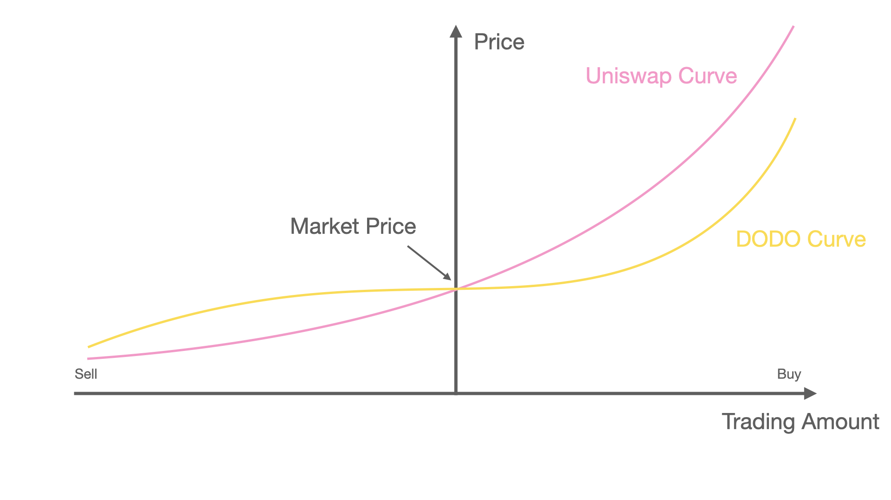
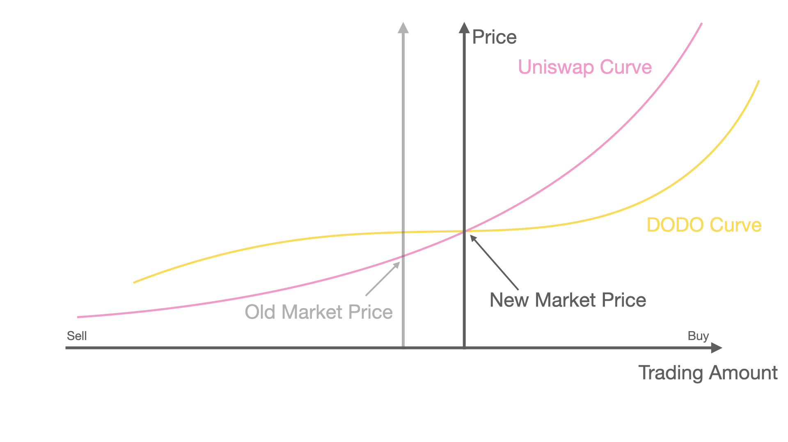

## 基本原理

DODO 的底层机制是一套被称为 PMM 的算法。PMM 算法接受 Oracle 提供的市场价格作为输入，专注在市场价格附近提供充足的流动性，而在远离市场价格时流动性快速衰减。

上图对比了 DODO 和 Uniswap 的价格曲线，可以发现在市场价附近（也就是所谓的盘口）可以提供比 AMM 好得多的价格。而当市场价移动时，不同与 AMM 依赖套利者交易改变价格，PMM 主动移动价格曲线。使得价格曲线在新市场价附近仍然保持平滑

## 极高的资金利用率

正如上文所述，PMM provides liquidity in the price range of zero to infinity just as CFMM. But, near the oracle price, the price curve is very smooth. And far away from oracle price, the curve is very sharp. 换一种理解方法就是，绝大部分资金被聚集到市场价附近。在市场价附近交易活跃，这些资金被反复换手，利用率自然相当高了。

## 单风险暴露（Single Risk Exposure）

The PMM price curve consists of two parts, bid and ask. The ask side liquidity is only determined by the amount of base token in the pool. And the bid side liquidity is only determined by the amount of quote token in the pool.

It allows the base and quote pools to have different sizes, and therefore allows liquidity providers deposit any amount of quote or base token.

:::tip

The design is very natural. Because when you take ask order, you take up liquidity providers’ base token and have nothing to do with the quote token.

:::

## 避免无常损失（No impermanent loss)

The question is the same as, how to guarantee liquidity providers withdraw what they deposit. The key is arbitrageurs. When users buy token, PMM slightly increases the price to attract arbitrageurs to sell token. To make sure the balance in the pool is always equal to the amount of liquidity providers staked.
